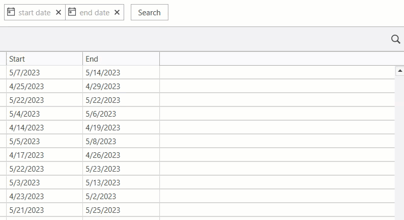

<!-- default badges list -->

<!-- default badges end -->

# WPF DateRangeControl — Create a Control

This example demonstrates how to create and use a [DateRangeControl](https://docs.devexpress.com/WPF/DevExpress.Xpf.Editors.DateRangeControl) in an application that searches flights for the tickets purchase.

## Implementation Details

* Use DateRangeControl in XAML markup.
* To customize the top area of the popup, use [DateRangeControl.PopupTopAreaTemplate](https://docs.devexpress.com/WPF/DevExpress.Xpf.Editors.DateRangeControl.PopupTopAreaTemplate).
* To customize the bottom area of the popup, use [DateRangeControl.PopupBottomAreaTemplate](https://docs.devexpress.com/WPF/DevExpress.Xpf.Editors.DateRangeControl.PopupBottomAreaTemplate).
* You can set predefined ranges in the [DateRangeControl.PredefinedRanges](https://docs.devexpress.com/WPF/DevExpress.Xpf.Editors.DateRangeControl.PredefinedRanges) property.

## Documentation

* [DateRangeControl](https://docs.devexpress.com/WPF/DevExpress.Xpf.Editors.DateRangeControl)
* 

<!-- default file list -->
## Files to Review

* [MainWindow.xaml](./CS/FlightTickets/MainWindow.xaml) (VB: [MainWindow.xaml](./VB/FlightTickets/MainWindow.xaml))
* [MainWindow.xaml.cs](./CS/FlightTickets/MainWindow.xaml.cs) (VB: [MainWindow.xaml.vb](./VB/FlightTickets/MainWindow.xaml.vb))

<!-- default file list end -->
